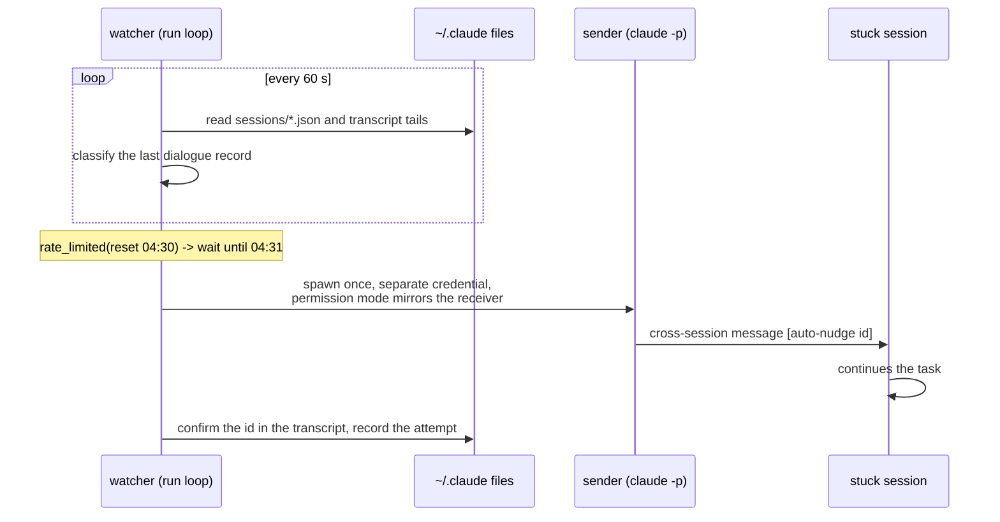

# claude-limit-watch

[](LICENSE)


Resume Claude Code sessions that are stuck on the five-hour usage limit.

One Python file, standard library only, no daemon framework. It watches the live Claude Code sessions on
your machine, waits for the limit to reset, and sends the stuck session one message so it picks up where
it stopped. In daily use on the author's machine; the first real event is in the log below.

## At a glance

```
02:00:46 proj-81: rate_limited(five_hour, reset 04:30) -> wait: not-yet (until 04:31)
02:15:46 alive: 2 live, 2 watched
...
04:31:49 proj-81: nudging (reset 04:30, ok, attempt 1, auto, via .../native-binary/claude)
04:32:04   -> delivered (msg_id 05fd2fb6-..., $0.094, auto)
04:33:04 proj-81: nudge 343050bd confirmed in transcript
```

The session had been rejected at 02:00 and sat idle for two and a half hours while its owner slept. It was
nudged 109 seconds after the reset, picked up its task 26 seconds later, and kept working. Cost: $0.094.

## Why

Long-running Claude Code sessions stop when the account's five-hour limit is hit. Sessions launched by the
Cursor / VS Code extension run in stream-json print mode, where Claude Code's own `autoContinueAtUsageLimit`
does not apply, so someone has to come back after the reset and type "continue". This tool does that.

Polling only reads local files. The one thing that costs money is the sender turn: a throw-away `claude -p`
process on a credential outside the blocked subscription, one Claude Haiku turn per nudge.

## How it works



1. List live sessions from `~/.claude/sessions/<pid>.json` and find each transcript under
   `~/.claude/projects/<cwd-slug>/<sessionId>.jsonl`.
2. Classify the last dialogue record: `rate_limited(reset HH:MM)`, `user_turn`, `assistant_done`,
   `api_error` or `unknown`. Only `rate_limited` with a known reset time is ever acted on.
3. Wait until the reset time plus one minute, then send one cross-session message from a temporary
   `claude -p` process whose permission mode mirrors the receiver (delivery requires the two modes to be in
   the same class). A second attempt flips the class five minutes later; there is no third.
4. Confirm the nudge id shows up in the receiver's transcript and record the attempt under
   `sessionId:resetsAt`, so a session is nudged at most twice per limit window.

Guarantees covered by the built-in selftest: never sends on `unknown`, never sends while the receiver is busy
or has already continued, idempotent per limit window, the credential is never written to the log, and only
one `run` loop can hold the lock.

## Requirements

| Item | Requirement |
|---|---|
| OS | macOS (verified). The watch loop should also work on Linux but is untested there; `launchd-plist` is macOS only. Windows is not supported (uses `fcntl` and `ps`). |
| Python | 3.9 or newer, no third-party packages. Selftest verified on 3.9, 3.12 and 3.13. |
| Claude Code | 2.1.270 or newer: cross-session messaging and `~/.claude/sessions/<pid>.json` are required. |
| User | Run as the same user who runs the sessions; it reads `~/.claude` (or `$CLAUDE_CONFIG_DIR`). |
| Sender credential | One of `OPENROUTER_API_KEY` (default model `anthropic/claude-haiku-4.5`), `ANTHROPIC_API_KEY`, or `ANTHROPIC_AUTH_TOKEN` with optional `ANTHROPIC_BASE_URL`. It must not be the blocked subscription. |
| `claude` binary | The sender reuses the target session's own binary (same version), else `$CLAUDE_LIMIT_WATCH_CLAUDE_BIN`, else `claude` on `PATH`. |

## Install

Option A, copy the file:

```bash
git clone https://github.com/0xKT/claude-limit-watch.git
install -m 755 claude-limit-watch/claude_limit_watch.py ~/.local/bin/claude-limit-watch
claude-limit-watch selftest
```

Option B, as a Claude Code skill (Claude performs the setup with you):

```bash
git clone https://github.com/0xKT/claude-limit-watch.git ~/.claude/skills/claude-limit-watch
```

Then type `/claude-limit-watch` in a new Claude Code session. The skill checks prerequisites, installs the
command, tells you how to store the credential without pasting it into the chat, registers sessions, runs a
dry pass and the chain test, and starts the loop. See [SKILL.md](SKILL.md).

## Quick start

```bash
umask 077; printf 'OPENROUTER_API_KEY=sk-or-v1-...\n' > ~/.claude/limit-watch.env

claude-limit-watch status                      # live sessions and what the loop would do now
claude-limit-watch watch --all                 # or: watch <name> "<resume message>"
claude-limit-watch run --once --dry-run        # one pass, logs only, never sends
claude-limit-watch send <name> "limit-watch chain test, please ignore"   # one paid turn, run while NOT limited

nohup claude-limit-watch run >> ~/.claude/limit-watch.log 2>&1 &
tail -f ~/.claude/limit-watch.log
```

Optional, survive reboots (macOS):

```bash
claude-limit-watch launchd-plist > ~/Library/LaunchAgents/com.user.claude-limit-watch.plist
launchctl bootstrap gui/$(id -u) ~/Library/LaunchAgents/com.user.claude-limit-watch.plist
```

## Commands

| Command | Purpose |
|---|---|
| `watch <name> [message]`, `watch --all [message]` | register sessions for nudging, optionally with a custom resume message |
| `unwatch <name>`, `unwatch --all` | remove registrations |
| `list` | registrations and attempt records |
| `status` | live sessions, verdicts and the decision the loop would take now |
| `classify <session or transcript path>` | classify one transcript |
| `send <name> <message> [--mode M] [--allow-subscription]` | send a message now (chain test) |
| `run [--interval N] [--once] [--dry-run] [--mode M] [--allow-subscription]` | the watch loop: 60 s poll, 30 min heartbeat, single instance |
| `selftest` | built-in fixtures plus mutation checks |
| `launchd-plist` | print a LaunchAgent plist for `run` |

## Configuration

Credential file `~/.claude/limit-watch.env`, one `KEY=value` per line (`export` prefix and quotes are
accepted). Values here override the process environment.

| Key | Meaning |
|---|---|
| `OPENROUTER_API_KEY` | send through OpenRouter, model `anthropic/claude-haiku-4.5` unless overridden |
| `ANTHROPIC_API_KEY` or `ANTHROPIC_AUTH_TOKEN` | send through the Anthropic API, or through any Anthropic-compatible gateway when `ANTHROPIC_BASE_URL` is set |
| `CLAUDE_LIMIT_WATCH_MODEL` | model for the sender turn |

Process environment variables:

| Variable | Meaning |
|---|---|
| `CLAUDE_LIMIT_WATCH_CLAUDE_DIR` | Claude Code config dir; default `$CLAUDE_CONFIG_DIR` or `~/.claude` |
| `CLAUDE_LIMIT_WATCH_STATE_DIR` | where the registry, lock and env file live; default is the config dir |
| `CLAUDE_LIMIT_WATCH_CLAUDE_BIN` | force a specific `claude` binary for the sender |
| `CLAUDE_LIMIT_WATCH_SENDER_MODE` | force the sender's permission mode instead of mirroring the receiver |

## Files

| Path | Role |
|---|---|
| `~/.claude/limit-watch.env` | sender credential, mode 600 |
| `~/.claude/limit-watch.json` | registrations and attempt records |
| `~/.claude/limit-watch.lock` | single-instance lock |
| `~/.claude/limit-watch.log` | loop log, when started as shown above |

## Reading the log

Every line other than the 30-minute heartbeat `alive: N live, N watched` is a state change. The decision
column of `status` and the arrow in the log use these reasons:

| Decision | Meaning |
|---|---|
| `wait: not-yet (until HH:MM)` | limited; the reset plus a one-minute grace has not passed |
| `wait: retry-spacing` | a first attempt went out less than five minutes ago |
| `send: ok` | nudging now |
| `skip: user_turn`, `skip: assistant_done`, `skip: api_error` | last record is not a rate limit; nothing to do |
| `skip: unknown` | transcript not found: a session that just started, or an idle tab that never sent a turn |
| `skip: busy` | the session wrote something after the limit record; it already continued |
| `skip: exhausted` | two attempts recorded for this limit window |
| `skip: stale` | the reset was more than 48 hours ago |
| `skip: rate-limited-unknown-reset` | rate limit without a usable reset time; nothing is sent |
| `skip: no-credential` | no sender credential in the env file or process environment |
| `skip: not-registered`, `skip: not-live` | not watched, or the session process is gone |

## Troubleshooting

- **`already running (pid N)` on start.** A loop already holds the lock; the new one exits without touching
  anything. Point `CLAUDE_LIMIT_WATCH_STATE_DIR` elsewhere to experiment beside a live loop.
- **`delivered` but no `confirmed` line.** The receiver has not written the nudge to its transcript yet.
  If it never does, the second attempt fires five minutes later with the other permission-mode class.
- **Chain test fails with an auth error.** The key in the env file does not match the key name (an OpenRouter
  key goes under `OPENROUTER_API_KEY`), or the file is unreadable: `stat -f '%Lp' ~/.claude/limit-watch.env`
  must print `600` and the file must belong to the user running the loop.
- **A closed tab is not resumed.** Only a live session process can receive a message; reopen the session
  and the watcher will see it again.
- **`--allow-subscription`** lets `send` or `run` proceed without a separate credential. It can only work
  while the account is not limited, so it is for chain tests, not for the loop.

## Limitations

- Verified on macOS with sessions started by the Cursor / VS Code extension and the CLI; Linux is untested.
- Needs a second credential. The blocked subscription cannot speak during the limit, by definition.
- Two attempts per limit window, then it stops; a session that ignores both is left alone.
- The resume message is generic on purpose; use `watch <name> "<message>"` for a task-specific one.

## Development

```bash
python3 claude_limit_watch.py selftest        # 17 fixtures, 6 mutation checks
```

The repository is four files: `claude_limit_watch.py` (the tool), `README.md`, `SKILL.md` and `LICENSE` (MIT).
The design follows an internal design note by a colleague; the implementation was rebuilt from that note with
Claude Code.
